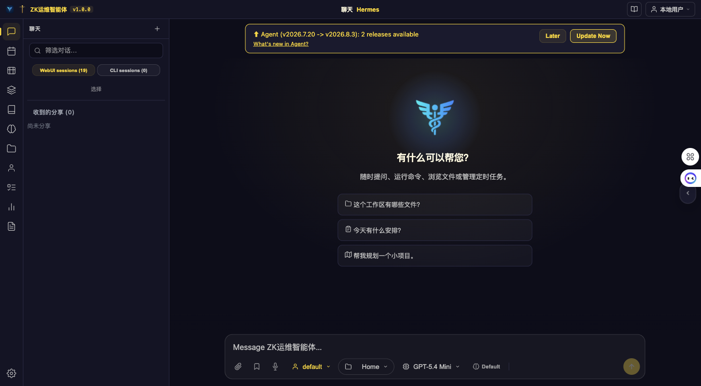
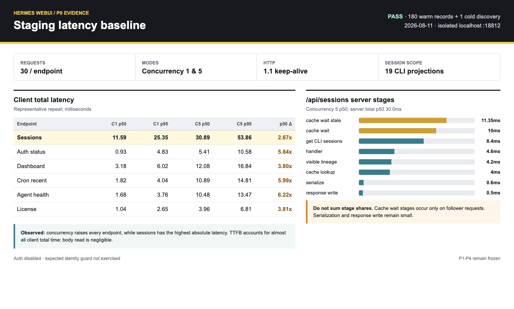

# P0 线上环境自动化测试方案

**状态：** 隔离 staging 基线与截图已执行；真实 RBAC 线上矩阵待专用测试账号执行
**日期：** 2026-08-11
**适用提交：** `ae74aa6a` 及其后续提交
**测试工具：** `scripts/p0_online_baseline.py`、ego-browser、P0 server diagnostics

## 1. 目的

本方案用于在不改变 session、workspace、RBAC、streaming、approval/clarify
语义的前提下，回答以下问题：

1. 页面看到的慢，是浏览器连接排队、共享 middleware、目标 handler、锁等待，
   还是响应序列化/写出造成的？
2. 单连接正常但 5 个并发连接变慢时，具体放大在哪个 stage？
3. test8/test11/test13 连续登录切换、删除唯一 workspace、BFCache 恢复后，是否
   出现旧身份、旧 workspace、旧 composer/file tree 数据残留？
4. 是否存在需要进入 P1/P2/P3 的、已经被数据证明的热点？

本方案默认只执行 GET 请求。不会自动发送聊天消息、删除 workspace、修改设置或
触发 agent turn。任何写操作必须在专用测试账号和专用 workspace 上单独执行。

## 2. P0 数据面

### 2.1 Server stages

目标接口：

- `GET /api/sessions`
- `GET /api/session/status`
- `GET /api/approval/pending`
- `GET /api/clarify/pending`
- `GET /api/auth/status`
- `GET /api/license/status`
- `GET /api/health/agent`
- `GET /api/crons/recent`
- `GET /api/dashboard/status`

公共阶段：

| Stage | 含义 |
|---|---|
| `start` / `request_entry` | handler 对象建立与诊断上下文初始化 |
| `license_middleware` | License 初始化、状态检查和 gate |
| `auth_middleware` | Cookie/session 校验 |
| `handler` | 路由分发及接口业务逻辑 |
| `response_serialize` | JSON 编码、可选 gzip、响应头准备 |
| `response_write` | socket 写响应阶段 |

`/api/sessions` 还会记录 index、CLI session、lineage、cache lookup/wait 等内部阶段。

### 2.2 Client phases

`scripts/p0_online_baseline.py` 使用 HTTP/1.1 keep-alive，记录：

- `connect_ms`：建立 TCP/TLS 连接；连接复用时为 0。
- `request_ms`：写请求头并提交请求。
- `ttfb_ms`：请求提交后等待响应头。
- `read_ms`：读取响应 body。
- `total_ms`：完整请求耗时。

每项输出 count、p50、p95、p99、max、状态码分布和响应字节数。非 200 或传输异常
会写入 `validation_failures` 并让进程返回非 0。Cookie 只从 `P0_TEST_COOKIE`
环境变量读取，不写入命令行、日志或结果文件。

## 3. 线上执行安全条件

执行前必须同时满足：

1. 使用 test8/test11/test13 等专用账号，禁止使用真实业务管理员账号压测。
2. 测试窗口已通知值班人员，并明确开始/结束时间和回滚人。
3. 首轮固定 `30 requests/endpoint`、并发 1；确认无异常后才允许并发 5。
4. 不在真实线上创建 100/500 个 session。大数据量场景必须使用线上数据快照的
   脱敏 staging 副本或合成数据目录。
5. 不采集 Cookie、token、密码、完整 workspace 路径或响应 body。
6. 观察期间任一接口 5xx、登录串号、workspace 越权、stream ghost state，立即停止。
7. 发压机或目标机 CPU、load average、磁盘 I/O 已处于告警状态时不开始；执行中资源
   饱和的窗口单独标记为 contaminated，不用于前后版本判断。

## 4. 详细执行步骤

### 步骤 1：记录环境基线

记录但不要截图/输出秘密：

```bash
git rev-parse --short HEAD
python3 --version
uptime
curl -fsS "$BASE_URL/health"
```

报告中填写：部署 SHA、Python 版本、是否经过反向代理、HTTP/1.1/HTTP/2、session
数量级、tab 数量、客户端/服务端 CPU 与 load average，以及是否存在
streaming/terminal 长连接。采集前后各记录一次；两次负载状态不可比时作废该轮。

### 步骤 2：开启有界 P0 采集

在目标 WebUI 进程加入：

```bash
HERMES_WEBUI_REQUEST_DIAGNOSTICS=1
```

也可使用既有兼容方式：

```bash
HERMES_WEBUI_SLOW_REQUEST_SECONDS=0
```

只保留一个开关。重启后确认新进程日志出现：

```text
WebUI request diagnostics: {...}
```

采集窗口建议不超过 10 分钟。日志中的身份只允许出现 `profile_hash`、
`auth_cookie_hash`、`user_id_hash` 等 request-salted hash。

### 步骤 3：准备短期认证上下文

通过密码管理器或 CI secret 注入专用账号 Cookie。不要把 Cookie 写进命令历史：

```bash
read -r -s P0_TEST_COOKIE
export P0_TEST_COOKIE
read -r P0_EXPECTED_USER_ID
export P0_EXPECTED_USER_ID
```

脚本先请求 `/api/auth/status`，只在 `user.id` 与 `P0_EXPECTED_USER_ID` 使用常量时间
比较一致后继续，且不会把用户标识写入报告。无认证的隔离 staging 可以跳过两个变量；
真实线上禁止省略预期身份。

### 步骤 4：单连接 warm baseline

```bash
python3 scripts/p0_online_baseline.py \
  --base-url "$BASE_URL" \
  --requests-per-endpoint 30 \
  --concurrency 1 \
  --server-log "$SERVER_LOG" \
  --output-dir "$RESULT_DIR/sequential"
```

验收：

- 报告必须显示 `Validation: PASS`；任意非 200、timeout 或连接错误使脚本返回 2。
- `/api/session/status` 只在 `/api/sessions` 返回非 CLI 的 WebUI session 时执行。
- 首个 cold request 与后续 warm request 分开解读，不使用单个 cold 值代表 p95。
- Server log 偏移由脚本自动记录，只解析本轮 warm 请求新增的 diagnostics；cold
  discovery 仍单列在客户端结果中。

### 步骤 5：5 连接并发 baseline

```bash
python3 scripts/p0_online_baseline.py \
  --base-url "$BASE_URL" \
  --requests-per-endpoint 30 \
  --concurrency 5 \
  --server-log "$SERVER_LOG" \
  --output-dir "$RESULT_DIR/concurrency-5"
```

验收：

- p95 不应无界增长或触发请求 timeout。
- 重点检查 cache wait、全局锁、License/auth、handler 是否随并发放大。
- response serialization/write 占比低时，不得用 gzip 或 JSON cache 当作主修复。

### 步骤 6：浏览器启动链路

使用 ego-browser 打开聊天首页，等待首屏稳定后采集：

1. 首屏截图。
2. `performance.getEntriesByType('resource')` 中所有 `/api/` 请求耗时。
3. `/api/sessions`、`/api/auth/status`、`/api/workspaces` 的状态和 body 大小。
4. Console error、未处理 promise rejection 和失败请求。

截图中不得出现响应 body、Cookie、用户路径或 workspace 绝对路径。结果截图使用脱敏
状态表、耗时表和阶段图；原始 JSON 只在内存中做断言。

浏览器 Resource Timing 包含连接池排队和浏览器调度；server diagnostics 从服务端
开始处理请求才计时。二者差值可提示连接排队，但当前响应未携带 server request id，
所以只能按同一测试窗口比较，不能逐请求强关联。

### 步骤 7：RBAC/workspace 连续切换

每个动作后等待 `/api/auth/status` 与 `/api/workspaces` 都完成，再截图并校验
`scope_user_id`：

1. test8（无 workspace）登录，确认空状态、composer 禁用/清理、file tree 为空。
2. logout 后登录 test11（无 workspace），不得出现 test8 状态。
3. logout 后登录 test13（1 workspace），只能出现 test13 workspace。
4. test13 logout 后登录 test8，必须立即恢复空状态。
5. test13 登录后切换 test3（有 workspace），两个用户路径、tree、composer 不混用。
6. test11 创建唯一 workspace 后删除，响应必须是 `workspaces: []`，不得看到其他
   用户 workspace。

每一步还要执行一次浏览器 back/forward，触发 BFCache 恢复后重新确认身份和
workspace。遇到响应中的 `scope_user_id` 与 `/api/auth/status.user.id` 不一致立即失败。

自动化证据固定命名，避免人工覆盖或漏场景：

| 场景 | 动作后必须等待 | 截图 | 核心断言 |
|---|---|---|---|
| T01 | test8 登录 | `01-test8-empty.png` | workspace 0、tree 0、旧 composer 0 |
| T02 | test8 logout、test11 登录 | `02-test11-empty.png` | 身份变更、仍为空、无 test8 缓存 |
| T03 | test11 logout、test13 登录 | `03-test13-one.png` | workspace 1、`scope_user_id` 一致 |
| T04 | test13 logout、test8 登录 | `04-test8-empty-again.png` | 从有到无立即清空三处 UI 状态 |
| T05 | test13 切换 test3 | `05-test3-scoped.png` | 两个有 workspace 用户互不混用 |
| T06 | test11 创建后删除唯一项 | `06-test11-delete-last.png` | 响应 `[]`，不得 fallback 到全局列表 |
| T07 | 每个场景 back/forward | `07-bfcache-rescope.png` | BFCache 恢复后重新请求并保持同 scope |

每张截图同时保存同序号的脱敏断言 JSON，只保留状态码、计数、布尔值、响应
`scope_user_id` 的匹配结果和 Resource Timing，不保存原始标识或路径。

### 步骤 8：实时状态场景

专用 session 中执行一轮可控短任务：

1. visible tab 启动 turn；记录 `/api/session/status.active_stream_id`。
2. 切到 hidden tab，等待 hidden poll/SSE recovery。
3. 回到前台，确认 turn 完成且 `active_stream_id` 清理。
4. 同时打开 terminal/SSE，再运行步骤 4、5，记录连接预算变化。
5. approval/clarify 仅在该 session 可见，其他测试用户不可见。

该步骤涉及真实 agent 执行，必须使用无副作用 prompt 和专用 workspace，不纳入默认
只读脚本。

### 步骤 9：停止采集与回滚

1. 删除 `HERMES_WEBUI_REQUEST_DIAGNOSTICS` 或恢复原 slow threshold。
2. 重启/滚动更新 WebUI。
3. 确认日志不再持续输出每个目标请求。
4. 注销测试账号并清理环境变量：`unset P0_TEST_COOKIE P0_EXPECTED_USER_ID`。
5. 保存脱敏 JSON、Markdown、截图；不保存原始带秘密日志。

## 5. 本次 staging 实测环境

本轮为安全验证，使用 `/tmp` 隔离的 `HERMES_HOME`、state 和 workspace，端口
`18812`，不读取/修改真实 WebUI state。License 为隔离目录内临时有效状态，auth
关闭。每个接口 30 次；按并发 1、并发 5 交替执行，并将冷启动和 warm 结果分开。

限制：隔离 agent home 仍能发现本机 19 个只读 CLI session 投影。修正后的采集器不再
把 CLI 投影当作可加载 WebUI session，因此本轮未执行 `/api/session/status`、
approval/clarify。该结果不能代替 test8/test11/test13 的真实 RBAC 验收。

### 5.1 截图 1：聊天首页



分析：

- 页面正常完成首屏渲染，没有卡在 loading、登录页或 License 页。
- 当前身份明确显示“本地用户”，不能被误认为已验证 RBAC 身份切换。
- sidebar 能显示 session 计数，中央无活动会话，composer 和 workspace selector
  正常出现，没有可见布局重叠。
- 页面顶部 agent update 检查不影响聊天主区域，但会占用启动期网络连接，必须纳入
  浏览器连接排队分析。

### 5.2 截图 2：脱敏耗时与阶段结果



分析：

- 6 个只读接口各 30 次，代表性复测的状态全部为 200；一轮包含 180 个 warm
  diagnostics 和单列的 1 个 cold discovery。
- 并发 5 的 `/api/sessions` server p50 为 30.0ms，图中 cache wait 只在 follower
  请求出现，所以各阶段占比不可相加。
- `response_serialize` 和 `response_write` 的 p50 分别为 0.6ms、0.5ms，不支持先做
  gzip/JSON payload cache。
- 图片明确标注 auth disabled 与 P1-P4 frozen，避免把 staging PASS 误当 RBAC 验收。

## 6. 客户端耗时结果

### 6.1 单连接与 5 连接对比

单位：ms。表中采用机器负载可接受时的代表性重复轮；cold discovery 不计入 warm
p50/p95。

| Endpoint | seq p50 | seq p95 | c5 p50 | c5 p95 | p50 放大 |
|---|---:|---:|---:|---:|---:|
| `/api/sessions` | 11.590 | 25.351 | 30.891 | 53.857 | 2.67x |
| `/api/auth/status` | 0.926 | 4.825 | 5.408 | 10.578 | 5.84x |
| `/api/dashboard/status` | 3.179 | 6.015 | 12.075 | 16.844 | 3.80x |
| `/api/crons/recent` | 1.818 | 4.042 | 10.888 | 14.810 | 5.99x |
| `/api/health/agent` | 1.684 | 3.756 | 10.481 | 13.472 | 6.22x |

结论：并发下所有接口都有放大，不是 `/api/sessions` 独有。`/api/sessions` 的绝对
耗时最高，但 auth/health/cron 的倍率更高，支持“共享前置路径或线程/连接竞争”需要
继续测量的判断，不能直接把所有延迟归因于 session JSON 数量。各接口 client total
几乎都由 TTFB 构成，body read 不是当前重点。

### 6.2 Runner 负载污染对比

同一 staging 后续观察到一个无关进程约占用 94% 单核 CPU。该窗口虽无状态码失败，
但延迟整体抬升，因此标为 contaminated：

| Endpoint | 代表性 seq p50/p95 | 污染 seq p50/p95 | 代表性 c5 p50/p95 | 污染 c5 p50/p95 |
|---|---:|---:|---:|---:|
| `/api/sessions` | 11.590 / 25.351 | 100.974 / 512.283 | 30.891 / 53.857 | 103.733 / 225.590 |
| `/api/dashboard/status` | 3.179 / 6.015 | 34.767 / 544.243 | 12.075 / 16.844 | 37.563 / 75.657 |
| `/api/auth/status` | 0.926 / 4.825 | 13.458 / 91.276 | 5.408 / 10.578 | 23.140 / 88.528 |

这说明“HTTP 全部 200”不足以让性能窗口有效。线上自动化必须同时采集 runner/target
资源水位，并要求至少两轮交替复测方向一致；污染窗口只用于证明环境敏感性。

### 6.3 Browser Resource Timing

浏览器首页启动窗口观察到：

| Endpoint | Browser p50 | Browser max | 同窗口 server max |
|---|---:|---:|---:|
| `/api/health/agent` | 330.7 | 1433.9 | 309.1 |
| `/api/crons/recent` | 152.7 | 1191.4 | 313.3 |
| `/api/auth/status` | 45.4 | 435.7 | 110.9 |
| `/api/sessions` | 39.8 | 64.1 | 49.0 |

浏览器最大值显著高于 server 处理时间，尤其是 health/cron/auth。这说明页面启动期
存在浏览器连接池排队、其他长请求占用或调度等待。由于目前没有共同 request id，
表中 server max 是测试窗口聚合值，不是与 browser max 一一对应的同一个请求。

`/api/sessions/events` 是长连接，Resource Timing 中的 60s+ duration 不能当作慢接口；
`/api/updates/check`、onboarding、models 等启动请求也会占用连接预算。

## 7. Server stage 分布

以下为并发 5、每接口 30 次的隔离 server diagnostics。

### 7.1 `/api/sessions`

总耗时：p50 30.0ms，p95 53.3ms，p99 53.6ms。代表性证据包含 30 个 warm 请求和
1 个单列 cold discovery；当前脚本已将 cold 请求排除出后续 server stage 聚合。

| Stage | p50 | p95 | p50/总耗时参考占比 |
|---|---:|---:|---:|
| `session_list_cache_wait_stale` | 11.35 | 14.40 | 37.83% |
| `session_list_cache_wait` | 10.00 | 13.50 | 33.33% |
| `get_cli_sessions` | 8.40 | 17.80 | 28.00% |
| `handler` | 4.60 | 10.70 | 15.33% |
| `visible_lineage_metadata` | 4.20 | 8.50 | 14.00% |
| `session_list_cache_lookup` | 4.00 | 9.00 | 13.33% |
| `license_middleware` | 2.90 | 7.50 | 9.67% |
| `response_serialize` | 0.60 | 2.20 | 2.00% |
| `response_write` | 0.50 | 1.10 | 1.67% |

阶段不会在每个请求上全部出现，参考占比不能直接相加。当前证据指向 CLI discovery、
cache single-flight wait 和 lineage，而不是序列化/写 socket。

### 7.2 其他接口

| Endpoint | server p50 | 主阶段 p50/占比 | 次阶段 p50/占比 |
|---|---:|---:|---:|
| `/api/dashboard/status` | 11.10 | handler 7.60 / 68.47% | License 3.00 / 27.03% |
| `/api/health/agent` | 9.85 | handler 5.55 / 56.35% | License 2.90 / 29.44% |
| `/api/crons/recent` | 10.30 | handler 6.95 / 67.48% | License 2.65 / 25.73% |
| `/api/auth/status` | 4.60 | License 2.80 / 60.87% | handler 0.70 / 15.22% |

结论：Dashboard 的 handler 是明确局部热点；auth 本身 handler 很轻，主要耗时在
共享 License gate。当前不支持给 `/api/auth/status` 增加全局 payload cache。

## 8. 通过标准与停止线

### 功能停止线

出现任一项立即停止并回滚诊断开关：

- `/api/auth/status.user.id` 与 workspace `scope_user_id` 不一致。
- 空 workspace 被 fallback 成其他用户 workspace。
- logout/login 或 BFCache 后旧 session、composer、file tree 仍可见。
- `active_stream_id` 在 turn 结束后不清理，或 hidden tab 无法恢复。
- approval/clarify 内容跨用户可见。

### 性能判断线

- 先要求“状态码无回归、无 timeout、并发 5 可完成”。
- runner/target 负载不可比、单轮方向与复测相反或 p95 方差超过团队约定阈值时，先
  作废窗口并重测，不据此修改生产代码。
- 真实线上基线采集完成后再冻结数值 SLO；不得拿 localhost 的亚毫秒 p50 作为线上
  SLO。
- 浏览器慢但 server 快时，优先调查 HTTP/1.1 连接预算、SSE/terminal、代理缓冲和
  启动请求并发，不进入 handler cache 改造。
- server `handler` 或具体内部 stage 稳定占 p95 主体时，才允许进入对应 P1/P2/P3。

## 9. 当前结论与下一步

1. P0 观测可以输出正常请求的窗口化阶段分布；默认关闭时不改变线上日志行为。
2. `/api/sessions` 并发热点是 CLI discovery/cache wait/lineage；序列化不是主因。
3. Dashboard handler 值得在真实配置上继续测量，但还不足以直接上线缓存。
4. runner 负载可使相同代码的 p95 放大一个数量级；线上基线必须先做环境有效性判定。
5. 浏览器启动链路存在明显的 server 外等待，需要增加可关联的响应 request id，
   再区分浏览器连接队列、代理和 server 排队。
6. 本轮未完成真实 test8/test11/test13、有效 WebUI session status、streaming 和
   approval/clarify 跨用户验证，因此 P1-P4 继续冻结。

## 10. 证据索引

- 单连接结果：`evidence/2026-08-11-p0-online-baseline/sequential/`
- 并发 5 结果：`evidence/2026-08-11-p0-online-baseline/concurrency-5/`
- 负载污染窗口：`evidence/2026-08-11-p0-online-baseline/runner-contention-*/`
- 浏览器资源时间：`evidence/2026-08-11-p0-online-baseline/browser-resource-timing.json`
- 截图：`evidence/2026-08-11-p0-online-baseline/screenshots/`
